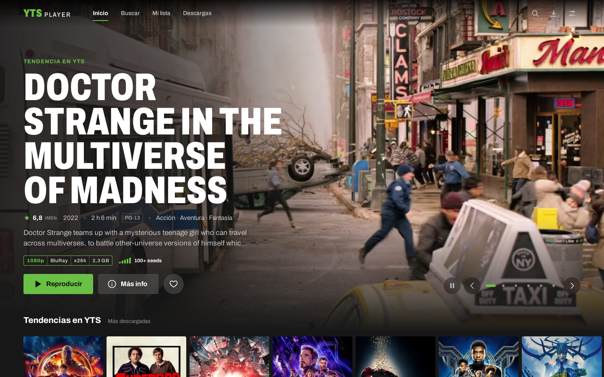
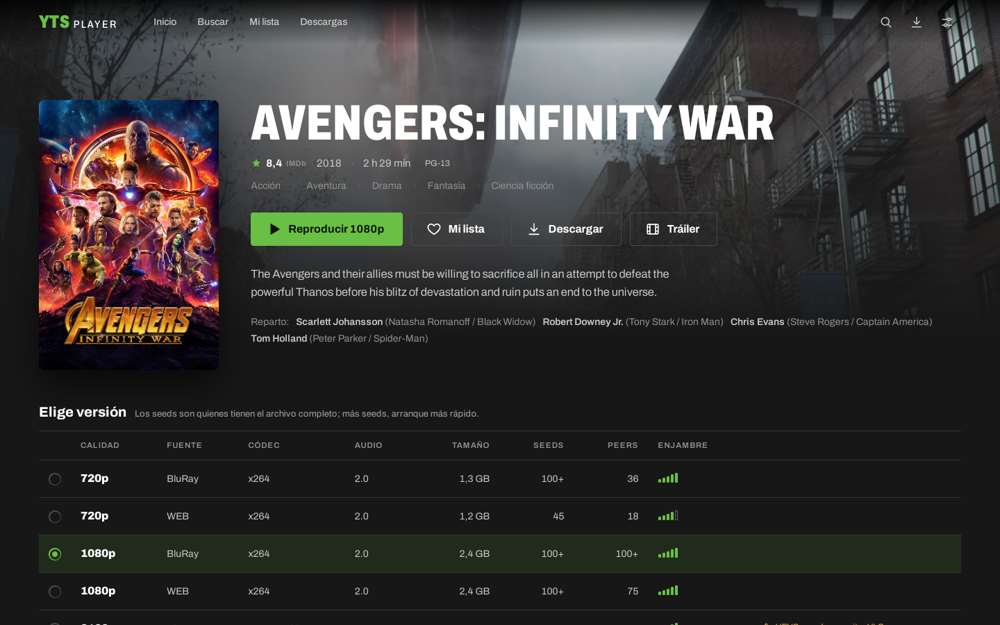
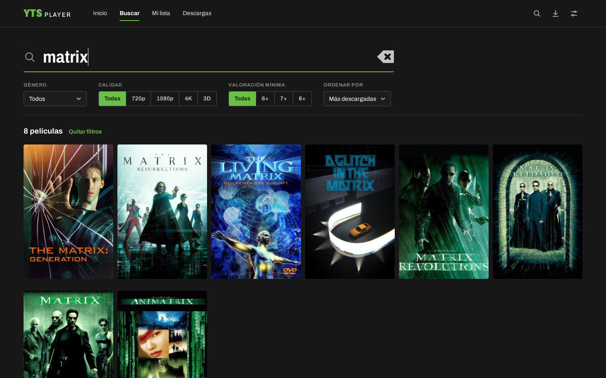

<p align="center">
  
</p>

<h1 align="center">YTS Player</h1>

<p align="center">
  A Netflix-style desktop app for the YTS catalog: browse, stream straight from the torrent and download to watch offline.
</p>

<p align="center">
  <a href="https://yts-player.netlify.app">Website</a> ·
  <a href="https://github.com/GabJS10/yts-movie-player/releases/latest">Download</a> ·
  <a href="CHANGELOG.md">Changelog</a> ·
  <a href="docs/PLAN.md">Architecture</a>
</p>

<p align="center">
  
</p>
<p align="center">
  
  
</p>

## What it does
- **A home that adapts to you:** a rotating banner with recommendations based on what you watched, your list and your genres, plus trending, recent and top-rated rows.
- **Instant streaming:** the movie starts in seconds while the torrent downloads, and you can skip to any point.
- **Automatic subtitles** from OpenSubtitles (Spanish by default, or the language you pick), with adjustable delay or your own `.srt`.
- **My list and Continue watching**, which resumes at the exact second.
- **Downloads** to watch offline, with pause, resume and the folder of your choice.
- **Trailers**, search with filters, full keyboard navigation and offline mode.
- x265/HEVC versions the app can't decode open in **VLC** with their subtitles.
- **In Spanish and English:** follows your system language, or pick one in Settings › Language.

## Installation (Windows 10/11)
Download `YTS.Player_1.1.1_x64-setup.exe` from the [latest release](https://github.com/GabJS10/yts-movie-player/releases/latest) and open it. It installs for your user only, with no administrator rights.

- **"Windows protected your PC":** the installer isn't signed (a code-signing certificate costs money). Click **More info → Run anyway**.
- **Firewall:** on first launch Windows asks whether `yts-player.exe` may use the network. Allow it on private networks to reach more peers; if you deny it, streaming still works but may be slower.
- x265/HEVC versions open in **VLC** if it's installed (with Microsoft's HEVC extension some of them play in the app itself).

## Installation (Linux)
Download the package for your distribution from the [latest release](https://github.com/GabJS10/yts-movie-player/releases/latest).

| Distribution | Package | Install |
|---|---|---|
| Ubuntu, Debian, Linux Mint, Pop!_OS | `.deb` | `sudo apt install ./YTS.Player_1.1.1_amd64.deb` |
| Fedora, openSUSE | `.rpm` | `sudo dnf install ./YTS.Player-1.1.1-1.x86_64.rpm` |
| Any other | AppImage | `chmod +x YTS.Player_1.1.1_amd64.AppImage && ./YTS.Player_1.1.1_amd64.AppImage` |

The `.deb` and `.rpm` install what's needed to play video (GStreamer with H.264/AAC). The AppImage already bundles it. Recommended: **VLC**, for the 2160p x265 versions.

The app lets you know when there's a new version.

## Subtitles: your OpenSubtitles API key
1. Create a free account on [opensubtitles.com](https://www.opensubtitles.com).
2. In your profile, go to **API consumers** and create one: copy the **API key**.
3. In the app: **Settings → Subtitles**, paste the key and click **Test**.

Without logging in, OpenSubtitles allows about 5 downloads a day; with a username and password (optional, in the same place), about 20. A subtitle you already downloaded is kept and doesn't use up quota again. The key and credentials are only stored on your computer.

## Where it keeps things
| What | Linux | Windows |
|---|---|---|
| Settings, My list, progress, subtitles | `~/.local/share/yts-player/` | `%LOCALAPPDATA%\yts-player\` |
| Streaming cache (limited, 10 GB by default) | `~/.local/share/yts-player/cache/` | `%LOCALAPPDATA%\yts-player\cache\` |
| Downloads | `~/.local/share/yts-player/library/` | `%LOCALAPPDATA%\yts-player\library\` |
| Logs | `~/.local/state/yts-player/logs/` | `%LOCALAPPDATA%\yts-player\logs\` |

The cache and downloads can go to any folder (or drive) you choose in Settings. Logs open from Settings → About → Open logs folder. Uninstalling the app doesn't delete this data.

## Building from source
Requirements: Node 24, stable Rust and, on Windows, the Visual Studio Build Tools (C++) with WebView2. On Ubuntu/Mint:
```bash
sudo apt install libwebkit2gtk-4.1-dev build-essential libssl-dev librsvg2-dev libayatana-appindicator3-dev \
  gstreamer1.0-libav gstreamer1.0-plugins-good gstreamer1.0-plugins-bad
```
```bash
npm install
npm run tauri dev      # development
npm run tauri build    # packages in src-tauri/target/release/bundle/ (.exe on Windows)
```
Tests: `npm test`, `cd src-tauri && cargo test`, and the E2E in [`e2e/`](e2e/) (`npm run ui` with Playwright, `npm run app` with WebdriverIO on the real app). The project was built in phases by several coordinated AI agents; see [`AGENTS.md`](AGENTS.md) and [`docs/ROADMAP.md`](docs/ROADMAP.md) (both in Spanish).

**Stack:** Tauri 2, React 19 + TypeScript, TanStack Router/Query, Tailwind; in Rust, librqbit (torrent), axum (local server with `Range`), rusqlite and reqwest.

## Legal notice
YTS Player is only a **client**: it doesn't host, upload or distribute any content. It shows the public catalog of the YTS API and uses BitTorrent to download what you choose; while you download, you also share parts of the file with other users.

Much of that catalog is protected by copyright, and downloading or sharing it may be illegal in your country. **Using the app is the user's responsibility.** This project has no relationship with YTS or OpenSubtitles.

## License
[MIT](LICENSE). The license covers the app's code, not the content accessed with it.
